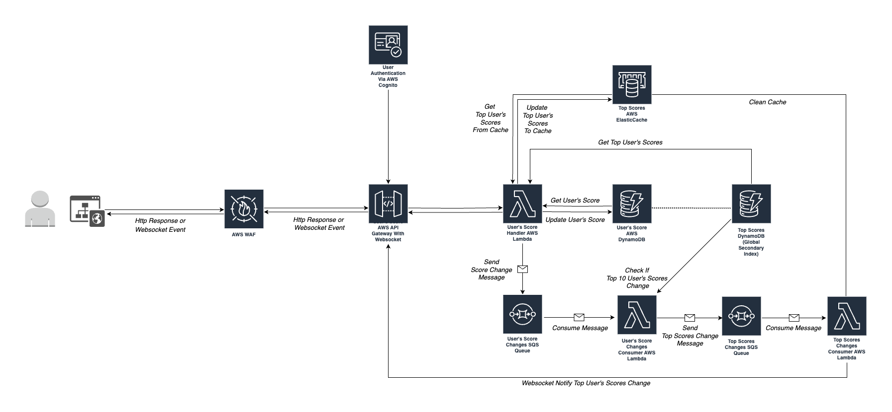
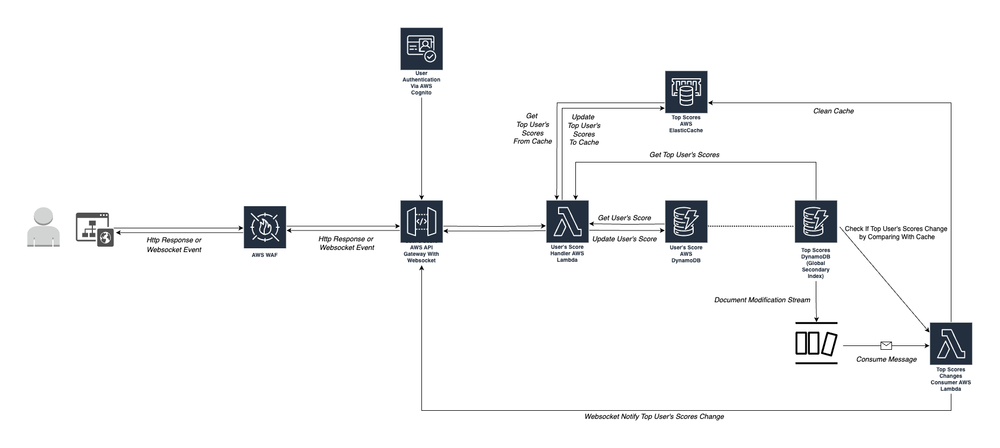

Code Challenge - Problem 6

1. System Diagram:

- Using SQS Queue for stream user's score change.
  
- Using DynamoBD Stream feature for stream user's score change.  
  

2. Specification:

- Technical Stacks: AWS Services: API Gateway with Websocket integrated, Lambda, SQS, DynamoDB, Elasticache, Cognito.
- Serverless Benefits:
  - Cost affective: Only pay for usage.
  - Enhanced scalability: In this api, instead of deploying `Load Balancer` with `Websocket Proxy` and putting `Container's Cluster` behind the Load Balancer, we can simple configure `AWS API Gateway with Websocket integration` then declare `AWS Lambda as User's Score Handler` behind the API Gateway. AWS Lambda auto scaling by default, the limitation can be adjusted by contacting aws https://docs.aws.amazon.com/lambda/latest/dg/gettingstarted-limits.html. For database, we can deploy database cluster with replication and separate writing and reading queries, but we can also use serverless friendly dynamodb(auto scaling by configuration).
  - Simplified operations: We can reduce the deployment effort by using Infrastructure As Code with Cloudformation, or some high level framework AWS CDK, Serverless Framework, Pulumi,...

3. Implementation:

- Model:

  - User Score:
    - userId: uuid
    - userName: string (can use email as username since we use AWS Cognito as Identity Provider)
    - userScore: number
    - scoreUpdatedAt: timestamp

- Database:
  - DynamoDB with `user-score` table.
  - Partition Key: userId
  - `Global Secondary Index` by `Partition Key(userId)` and `Sort Key(userScore)`
- Logics:

  - Separate the user's score getting/updating from top user's scores api for scalability.
  - When user's score change, trigger sqs messages, then declare lambda function to consume the messages concurrently.
  - Check from message's timestamp, elastic cache, user-score table (`using global secondary index`) to verify if top score users has changes.
  - Clean elastic cache and emit websocket notification event.
  - For security and ddos prevention, we use AWS WAS as application firewall.

- Tool / Library:
  - AWS Serverless Services.
  - Serverless Framework: https://www.serverless.com/framework/docs. (Depend on team discussion).
  - NodeJS, Typescript.
